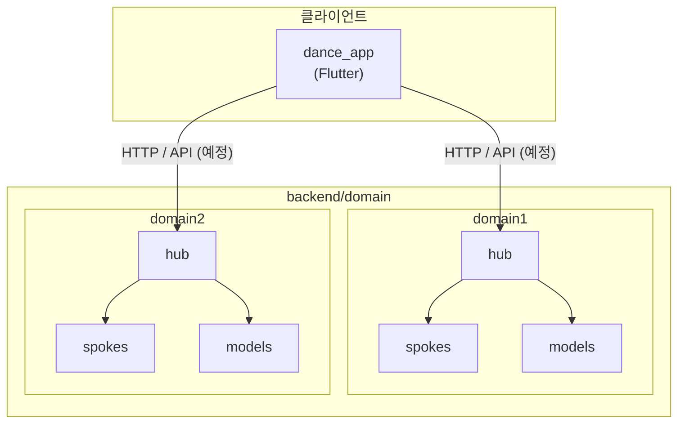
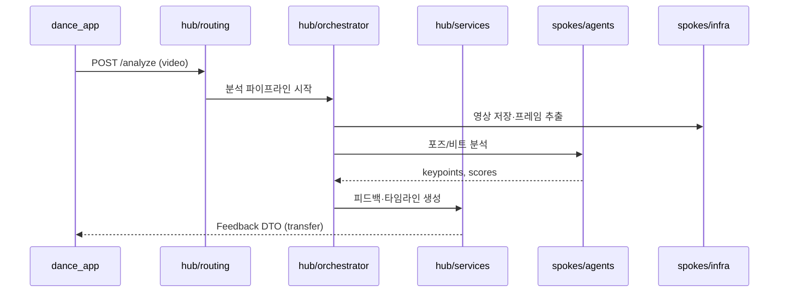
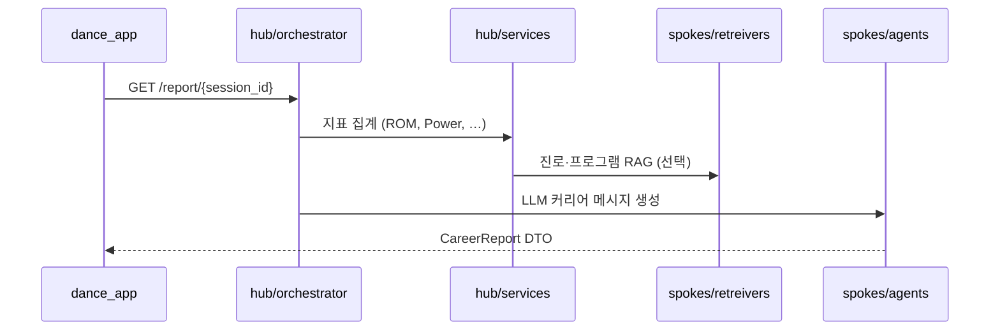

# Backend 아키텍처

> **문서 목적:** `backend/` 디렉터리에 정의된 **도메인 단위 Hub–Spoke** 구조를 설명하고, Dance AI Flutter 앱(`dance_app`)과의 연동 관점을 정리합니다.

---

## 1. 개요

| 항목 | 내용 |
|------|------|
| **역할** | AI 스트릿 댄스 레벨 판정·커리어 가이드 플랫폼의 서버/AI 파이프라인 |
| **설계 패턴** | **Bounded Context(도메인)** + **Hub(중앙 허브)** + **Spoke(외곽 어댑터)** |
| **언어** | Python (패키지 스캐폴드, `__init__.py` 기준) |
| **현재 상태** | 폴더·레이어 구조만 존재, 구현 코드·API 서버 미구성 |

프론트(`dance_app`)는 현재 Mock Repository로 동작하며, 추후 본 백엔드(FastAPI 등)와 REST/WebSocket으로 연결할 것을 전제로 합니다.

---

## 2. 최상위 구조

```
backend/
└── domain/                    # 비즈니스 도메인(Bounded Context) 루트
    ├── domain1/               # 도메인 1 (예: 동작 분석·피드백)
    ├── domain2/               # 도메인 2 (예: 커리어·LLM 리포트)
    └── asdasd/                # 스캐폴드/실험용 복제본 (이름 정리 권장)
```

각 도메인은 **동일한 내부 레이아웃**을 따릅니다. 도메인 간 직접 import를 최소화하고, Hub의 서비스·오케스트레이터를 통해서만 협력하는 것을 권장합니다.



---

## 3. 도메인 내부 레이아웃 (공통)

모든 도메인(`domain1`, `domain2`, …)은 아래 구조를 공유합니다.

```
domain/{domain_name}/
├── docs/
│   └── audit_trail.md       # 감사·의사결정 기록 (도메인별)
├── hub/                      # 중앙 — 유스케이스·조율·진입
│   ├── services/             # 도메인 애플리케이션 서비스
│   ├── repositories/         # 영속성 추상화(포트)
│   └── mcp/                  # MCP(Model Context Protocol) 연동
├── spokes/                   # 외곽 — AI·인프라·외부 시스템
│   ├── agents/               # LLM/에이전트 실행
│   └── infra/                # DB, 스토리지, 메시징 등 인프라 어댑터
└── models/                   # 도메인 모델·계약
    ├── bases/                # 엔티티/값 객체 베이스
    ├── states/               # 상태·상태 머신 정의
    └── transfer/             # DTO·요청/응답 전송 객체
```

상세 역할은 [DOMAIN_LAYERS.md](./DOMAIN_LAYERS.md)를 참고하세요.

---

## 4. Hub vs Spoke

| 구분 | Hub | Spoke |
|------|-----|-------|
| **비유** | 허브(중앙 역) | 스포크(바퀴살) |
| **책임** | 유스케이스 조합, 트랜잭션 경계, 라우팅, 정책 | 외부 기술·AI·저장소 구현 |
| **의존 방향** | Spoke 인터페이스에 의존(포트) | Hub가 정의한 계약 구현(어댑터) |
| **변경 빈도** | 비즈니스 규칙 변경 시 | 인프라·모델 교체 시 |

**의존성 규칙 (권장)**

```
models  ←  hub  →  spokes
         ↑
    (orchestrator가 services·repositories·spokes 조합)
```

- `models`는 다른 레이어에 의존하지 않음.
- `hub`는 `models`와 spoke **인터페이스**만 참조.
- `spokes`는 `hub`의 repository/port를 구현하거나, orchestrator가 주입한 콜백을 호출.

---

## 5. 도메인별 역할 (권장 매핑)

도메인 폴더명(`domain1`, `domain2`)은 플레이스홀더입니다. Dance AI 제품 흐름에 맞춰 아래처럼 **역할을 나누는 것**을 권장합니다.

| 도메인 | 권장 책임 | Flutter 화면 연관 |
|--------|-----------|-------------------|
| **domain1** | 영상 업로드 메타, 포즈/리듬 분석, 피드백·타임라인·점수 | Studio → Loading → **Feedback** |
| **domain2** | 재능 지표 집계, 레이더 차트 데이터, LLM 커리어 가이드 | **Report** (재능 리포트) |
| **공통/추후** | 레퍼런스 챌린지 목록(Home) | **Home** — 별도 `catalog` 도메인 또는 domain1 하위 |

### 5.1 domain1 — 동작 분석 (예시 플로우)



### 5.2 domain2 — 커리어·재능 리포트 (예시 플로우)



---

## 6. `models` 레이어 개요

| 하위 폴더 | 용도 | 예시 (Dance AI) |
|-----------|------|-----------------|
| `bases/` | 도메인 엔티티·값 객체 베이스 | `AnalysisSession`, `Score` |
| `enums/` | 장르, 난이도, 분석 단계 | `Genre`, `Difficulty`, `PipelineStage` |
| `states/` | 세션·작업 상태 | `pending` → `analyzing` → `done` |
| `transfer/` | API 요청/응답 DTO | `FeedbackResponse`, `CareerReportResponse` |

Flutter Mock과 1:1로 맞출 DTO 예:

- **Home:** `DanceVideo` 목록
- **Feedback:** 리듬/포즈 점수, 타임라인 미스 포인트
- **Report:** 레이더 5축, `aiMessage`, `recommendedCareers`

---

## 7. `hub` 하위 모듈

| 모듈 | 역할 |
|------|------|
| **orchestrator/** | 다단계 AI 파이프라인(비전 → 점수 → LLM) 순서·재시도·타임아웃 |
| **routing/** | HTTP 라우트, 이벤트 핸들러, 도메인 간 메시지 분기 |
| **services/** | 단일 유스케이스(점수 계산, 리포트 조립) — orchestrator가 호출 |
| **repositories/** | DB/캐시/파일 메타 접근 인터페이스(구현은 `spokes/infra`) |
| **mcp/** | MCP 도구·리소스 등록 — 에이전트·외부 도구 표준 연동 |

---

## 8. `spokes` 하위 모듈

| 모듈 | 역할 |
|------|------|
| **agents/** | LLM 호출, 프롬프트 체인, 비전 모델 래퍼 |
| **retreivers/** | 벡터 DB·문서 검색(RAG) — 진로체험센터 등 추천 근거 |
| **infra/** | S3/로컬 스토리지, PostgreSQL, Redis, 큐 등 |

---

## 9. 도메인 문서 (`docs/audit_trail.md`)

각 도메인의 `docs/audit_trail.md`는 **아키텍처 결정·변경 이력**을 남기는 용도입니다.

- API 스키마 변경
- 모델 버전·프롬프트 변경
- 개인정보·영상 보관 정책

현재 파일은 비어 있으며, 구현 시 결정 사항을 도메인별로 기록합니다.

---

## 10. Flutter 앱과의 경계

| 앱 기능 | 백엔드 담당 (예정) | 주 도메인 |
|---------|-------------------|-----------|
| 챌린지 목록 | 레퍼런스 CRUD/목록 API | catalog 또는 domain1 |
| 영상 업로드 | 업로드 URL·세션 생성 | domain1 |
| 로딩/분석 | 비동기 작업 + 폴링/WebSocket | domain1 `orchestrator` |
| AI 피드백 | 점수·타임라인·교정 포인트 | domain1 |
| 재능 리포트 | 레이더·LLM 메시지·진로 추천 | domain2 |

**인증:** MVP 앱 명세상 로그인 없음 — 백엔드도 초기에는 익명 `session_id` 또는 디바이스 토큰 수준으로 설계 가능.

---

## 11. 구현 로드맵 (권장 순서)

1. **공통** — `pyproject.toml` / FastAPI 앱 엔트리, `domain/` 패키지 등록
2. **models/transfer** — Flutter Mock과 동일한 DTO 정의
3. **domain1** — 업로드 + 분석 Mock API → 실제 비전 파이프라인
4. **domain2** — 리포트 API + LLM spoke
5. **hub/orchestrator** — Loading 화면 7초 대기를 서버 작업 상태와 동기화
6. **docs/audit_trail** — 스키마·모델 버전 기록

---

## 12. 현재 제한 사항

| 항목 | 상태 |
|------|------|
| API 서버 (`main.py`, FastAPI) | 없음 |
| `domain1` / `domain2` 비즈니스 코드 | 빈 `__init__.py`만 존재 |
| `asdasd` 도메인 | 템플릿 복제본 — 프로덕션 전 이름·삭제 정리 권장 |
| `retreivers` 폴더명 | `retrievers` 오타 — 리네이밍 시 import 경로 일괄 수정 |
| 테스트·CI | 미구성 |

---

## 13. 관련 경로

| 경로 | 설명 |
|------|------|
| `backend/domain/domain1/` | 동작 분석 도메인 스캐폴드 |
| `backend/domain/domain2/` | 커리어 리포트 도메인 스캐폴드 |
| `backend/docs/DOMAIN_LAYERS.md` | 레이어별 상세 가이드 |
| `dance_app/docs/APP_SCREEN_GUIDE.md` | 클라이언트 화면·API 소비 관점 |

---

*문서 기준: `backend/` 디렉터리 스캐폴드 구조 (구현 전)*
