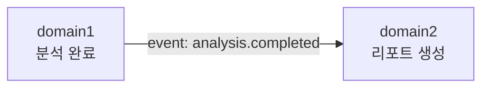

# 도메인 레이어 상세 (Hub / Spokes / Models)

> 각 `backend/domain/{name}/` 패키지 내부의 **폴더별 책임**, **허용 의존성**, **구현 시 넣을 코드 예시**를 정리합니다.

---

## 1. 레이어 다이어그램

```
                    ┌─────────────────────────────────────┐
                    │           hub/                      │
                    │  routing → orchestrator → services  │
                    │              ↓                      │
                    │         repositories (port)         │
                    │              ↓                      │
                    │              mcp                    │
                    └──────────────┬──────────────────────┘
                                   │ implements / calls
                    ┌──────────────▼──────────────────────┐
                    │          spokes/                      │
                    │   agents │ retreivers │ infra          │
                    └──────────────┬──────────────────────┘
                                   │ reads/writes
                    ┌──────────────▼──────────────────────┐
                    │          models/                      │
                    │  bases │ enums │ states │ transfer   │
                    └─────────────────────────────────────┘
```

---

## 2. `models/` — 도메인 계약

**원칙:** 순수 데이터·타입만. HTTP, DB, LLM SDK import 금지.

### 2.1 `models/bases/`

- 공통 베이스 클래스·믹스인
- 예: `Entity`, `ValueObject`, 타임스탬프·ID 필드

```python
# 예시 (구현 시)
# class Entity:
#     id: str
#     created_at: datetime
```

### 2.2 `models/enums/`

- 도메인 상수
- 예 (domain1): `AnalysisStatus`, `MistakeTag`
- 예 (domain2): `TalentAxis` (ROM, POWER, RHYTHM, …)

### 2.3 `models/states/`

- 상태 머신·세션 생명주기
- 예: `AnalysisSessionState`: `UPLOADED` → `PROCESSING` → `COMPLETED` | `FAILED`

### 2.4 `models/transfer/`

- **API 경계 DTO** — Flutter·OpenAPI와 공유할 스키마
- Pydantic `BaseModel` 또는 dataclass 권장

| DTO (domain1 예) | 필드 예 |
|------------------|---------|
| `AnalyzeVideoRequest` | `video_url`, `challenge_id` |
| `FeedbackResponse` | `rhythm_accuracy`, `pose_match`, `mistakes[]` |

| DTO (domain2 예) | 필드 예 |
|------------------|---------|
| `CareerReportResponse` | `genre`, `overall_score`, `radar`, `ai_message`, `careers[]` |

---

## 3. `hub/` — 애플리케이션 코어

외부 세계(HTTP, CLI, 메시지)의 **진입점**이며, 유스케이스를 조합합니다.

### 3.1 `hub/routing/`

| 항목 | 내용 |
|------|------|
| **역할** | URL·이벤트 → orchestrator/service 핸들러 매핑 |
| **포함 예** | FastAPI `APIRouter`, 미들웨어, 요청 검증 |
| **하지 않을 것** | LLM 직접 호출, SQL 직접 작성 |

```text
POST /api/v1/analyze     → orchestrator.start_analysis
GET  /api/v1/feedback/{id} → services.get_feedback
GET  /api/v1/report/{id}   → (domain2) orchestrator.build_report
```

### 3.2 `hub/orchestrator/`

| 항목 | 내용 |
|------|------|
| **역할** | 여러 spoke·service를 **순서대로** 실행하는 워크플로 |
| **포함 예** | 단계별 진행률(Loading 화면 메시지와 매핑), 실패 시 롤백/보상 |
| **하지 않을 것** | 세부 알고리즘(점수 공식은 `services`로) |

**domain1 오케스트레이션 단계 예**

1. `infra` — 영상 저장
2. `agents` — 포즈 추출
3. `agents` — 비트/리듬 정렬
4. `services` — 타임라인·교정 포인트 생성
5. `repositories` — 결과 영속화

### 3.3 `hub/services/`

| 항목 | 내용 |
|------|------|
| **역할** | **단일 유스케이스** 단위 비즈니스 로직 |
| **포함 예** | `compute_rhythm_score()`, `build_mistake_timeline()` |
| **의존** | `models`, `repositories`(인터페이스), 필요 시 spoke 호출 |

### 3.4 `hub/repositories/`

| 항목 | 내용 |
|------|------|
| **역할** | **포트(Port)** — 저장·조회 인터페이스 |
| **구현 위치** | `spokes/infra` (어댑터) |
| **포함 예** | `AnalysisRepository`, `ChallengeCatalogRepository` |

```python
# 예시 (구현 시) — 인터페이스만 hub에
# class AnalysisRepository(Protocol):
#     async def save(self, session: AnalysisSession) -> None: ...
#     async def get(self, session_id: str) -> AnalysisSession | None: ...
```

### 3.5 `hub/mcp/`

| 항목 | 내용 |
|------|------|
| **역할** | [Model Context Protocol](https://modelcontextprotocol.io/) 도구·리소스 노출 |
| **용도** | Cursor/에이전트가 백엔드 도구를 표준 방식으로 호출 |
| **포함 예** | `list_challenges`, `run_analysis` MCP tool 정의 |

---

## 4. `spokes/` — 인프라·AI 어댑터

**원칙:** Hub가 정한 포트·DTO를 구현. 도메인 규칙은 Hub에 두고, spoke는 “어떻게”만 담당.

### 4.1 `spokes/agents/`

| 항목 | 내용 |
|------|------|
| **역할** | LLM·비전 모델 호출, 프롬프트, structured output 파싱 |
| **예** | 커리어 격려 메시지 생성, 포즈 설명 문장화 |
| **설정** | API 키·모델명은 환경 변수, 코드에 하드코딩 금지 |

### 4.2 `spokes/retreivers/`

| 항목 | 내용 |
|------|------|
| **역할** | RAG — 진로 프로그램·FAQ 검색 |
| **예** | “지역 진로체험센터” 문서 임베딩 검색 → LLM 컨텍스트 |
| **참고** | 디렉터리명 `retreivers` → 추후 `retrievers`로 정리 권장 |

### 4.3 `spokes/infra/`

| 항목 | 내용 |
|------|------|
| **역할** | DB, 객체 스토리지, 캐시, 큐, 외부 HTTP 클라이언트 |
| **예** | PostgreSQL `AnalysisRepository` 구현, S3 업로드 |

---

## 5. `docs/` (도메인 루트)

| 파일 | 용도 |
|------|------|
| `audit_trail.md` | ADR 스타일 결정 기록 — 날짜, 결정, 대안, 영향 |

**기록 예시**

```markdown
## 2026-05-19 — 분석 결과 보관 기간
- 결정: 원본 영상 7일, 키포인트 JSON 90일
- 이유: MVP 스토리지 비용·개인정보 최소화
```

---

## 6. 도메인 간 통신

| 방식 | 사용 시점 |
|------|-----------|
| **동기 HTTP** (domain1 → domain2) | 리포트 생성 시 분석 결과 ID만 전달 |
| **이벤트/큐** (권장 확장) | 분석 완료 → `AnalysisCompleted` → domain2 리포트 생성 |
| **공유 DB 금지** | 도메인 테이블 직접 조인 지양 |



---

## 7. 디렉터리 체크리스트 (새 도메인 추가 시)

새 Bounded Context `domainX` 추가 시 `domain1`과 동일 트리 복제 후:

- [ ] `models/transfer`에 공개 API DTO 정의
- [ ] `hub/routing`에 라우터 등록
- [ ] `hub/repositories` 포트 + `spokes/infra` 구현
- [ ] `docs/audit_trail.md`에 도메인 목적 1문단 기록
- [ ] `backend/docs/ARCHITECTURE.md` 도메인 매핑 테이블 갱신

---

## 8. 파일 배치 빠른 참조

| 하려는 일 | 넣을 위치 |
|-----------|-----------|
| API 경로 추가 | `hub/routing/` |
| 3단계 이상 AI 파이프라인 | `hub/orchestrator/` |
| 점수·규칙 한 덩어리 | `hub/services/` |
| DB 쿼리 구현 | `spokes/infra/` |
| OpenAI/Claude 호출 | `spokes/agents/` |
| 벡터 검색 | `spokes/retreivers/` |
| JSON 스키마·응답 모델 | `models/transfer/` |

---

[← ARCHITECTURE.md](./ARCHITECTURE.md) · [문서 목록](./README.md)
