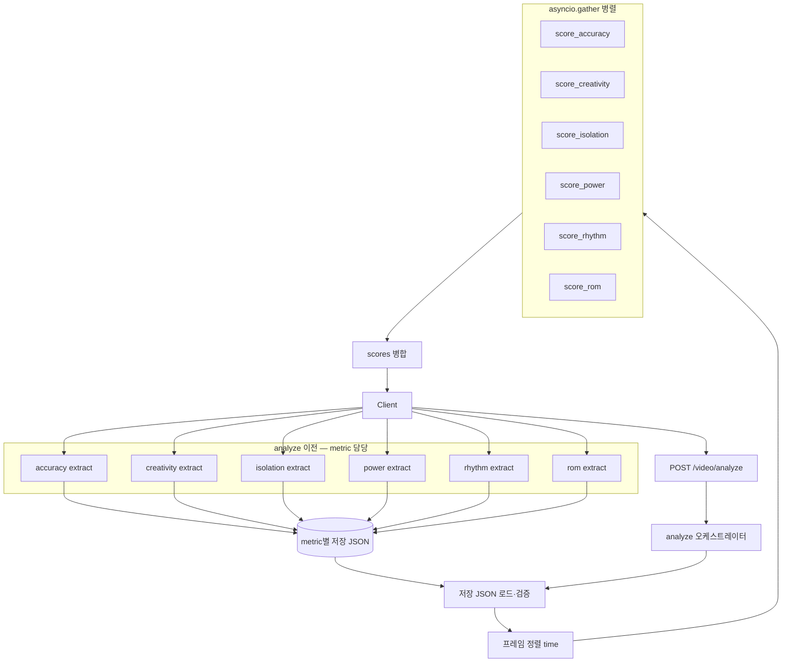
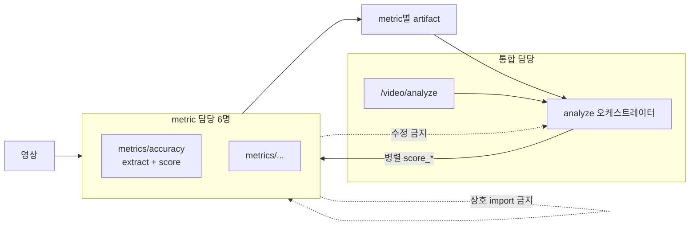

# Metrics 아키텍처


---


## 1. 구성


| 서비스 | 담당 범위 |

|--------|-----------|

| accuracy | `metrics/accuracy/` |

| creativity | `metrics/creativity/` |

| isolation | `metrics/isolation/` |

| power | `metrics/power/` |

| rhythm | `metrics/rhythm/` |

| rom | `metrics/rom/` |


- **6명 · 1인 1서비스** — 자기 `metrics/<이름>/` 만 수정한다.

- **다른 metric 폴더·라우터·analyze 오케스트레이터** 는 수정하지 않는다.

- **다른 metric의 추출 파이프라인** 도 수정하지 않는다.

- metric 서비스끼리 **import·호출하지 않는다.**


### 1.1 추출 vs 채점 경계


| 구분 | 담당 | 설명 |

|------|------|------|

| **영상 → 데이터 추출** | 각 metric (`metrics/<이름>/`) | MediaPipe·BPM·가속도 등 **자기 지표에 필요한 특성**만 각자 파이프라인으로 산출 |

| **`POST /video/analyze` 채점** | 통합 (analyze 오케스트레이터) | **이미 저장된** 추출 결과를 로드·정렬·`score_*` 병렬 호출·병합 |


- analyze 오케스트레이터는 **영상 추출·MediaPipe·공용 extract 파이프라인을 실행하지 않는다.**

- “오케스트레이터가 한 번 추출한 뒤, 각 도메인이 필터만 한다”는 모델이 **아니다.**

- 추출과 채점(`score_*`)은 **같은 metric 폴더 안**에서 담당하되, **analyze 요청 안에서는 추출 단계가 없다.**


**통합(오케스트레이션) 영역** — metric 6명이 아닌 별도 담당:


- `POST /video/analyze` 라우터

- analyze 오케스트레이터 (**저장된 추출 결과** 로드, 정렬, 6서비스 병렬 호출, 결과 병합)


통합 라우터에 `POST /video/extract`가 있더라도, **추출 로직은 `metrics/<이름>/` 내부**에 두고 통합층은 위임·라우팅만 한다 (로직 소유는 metric).


---


## 2. API 흐름


| 순서 | 시점 | 역할 | 담당 |

|------|------|------|------|

| 1 | **analyze 이전** | 사용자·레퍼런스 영상 → **metric별** 추출 JSON/특성 저장 | 각 `metrics/<이름>/` (`extract_*` 등) |

| 2 | `POST /video/analyze` | 6차원 채점 (추출 없음) | analyze 오케스트레이터 |


클라이언트는 analyze 호출 전에, 필요한 metric마다 추출을 완료해 두거나, 통합 API가 metric 모듈을 **순차/병렬로 호출**해 artifact를 만든 뒤 analyze를 호출한다.


### 2.1 `POST /video/analyze`


**요청** (예시 — metric마다 저장 경로·스키마가 다를 수 있음)


```json

{

  "user_json": "<사용자 추출 JSON 파일명 (또는 metric별 manifest)>",

  "reference_json": "<레퍼런스 추출 JSON 파일명>",

  "alignment_method": "time"

}

```


향후 metric별 artifact가 분리되면 `user_json` / `reference_json`을 metric 키별로 받는 형태로 확장할 수 있다. **오케스트레이터는 여전히 영상 파일을 받아 추출하지 않는다.**


**응답 (핵심)**


```json

{

  "alignment": { "method": "time", "pair_count": 120 },

  "scores": {

    "accuracy": { "score": 85.0, "breakdown": {} },

    "creativity": { "score": 80.0, "breakdown": {} },

    "isolation": { "score": 70.0, "breakdown": {} },

    "power": { "score": 68.0, "breakdown": {} },

    "rhythm": { "score": 65.0, "breakdown": {} },

    "rom": { "score": 72.0, "breakdown": {} },

    "total_score": 73.33,

    "grade": "B"

  }

}

```


- `total_score`·`grade`는 **오케스트레이터**가 6개 `score`를 합쳐 계산한다 (metric 서비스 책임 아님).


---


## 3. 런타임 구조





### 3.1 오케스트레이터 단계


| 단계 | 동기/비동기 | 설명 |

|------|-------------|------|

| JSON 로드·검증 | 동기, 1회 | **이미 추출·저장된** 사용자·레퍼런스 artifact (영상 처리 없음) |

| 프레임 정렬 | 동기, 1회 | `alignment_method: time` → `aligned_pairs` |

| 6채점 | **비동기 병렬** | 각 metric `score_*` 동시 실행 |

| 병합 | 동기 | `scores` + `total_score` + `grade` |


**오케스트레이터에 없는 단계:** 영상 디코딩, MediaPipe, metric별 특성 추출, 스무딩·정규화 파이프라인.


### 3.2 병렬 실행


- 라우터: `async` 핸들러.

- 각 metric `score_*`: **동기 함수**.

- `asyncio.gather` + `run_in_executor`로 6개를 **동시에** 실행한다.

- 입력(`aligned_pairs`, `user_extraction` 등)은 **읽기 전용** — scorer가 변경하지 않는다.

- 하나라도 실패하면 요청 전체 실패 (부분 응답 없음).


---


## 4. 오케스트레이터 → metric 입력


| 서비스 | 오케스트레이터가 넘기는 인자 |

|--------|------------------------------|

| accuracy | `aligned_pairs` |

| creativity | `aligned_pairs` |

| isolation | `aligned_pairs` |

| rom | `aligned_pairs` |

| power | `user_extraction` (사용자 JSON 전체) |

| rhythm | `user_extraction` |


- 위 JSON은 **해당 metric이 이미 추출해 둔 artifact**를 오케스트레이터가 로드한 것이다.

- `score_*` 내부에서 추가 가공·필터는 metric 자유. **영상 재추출은 analyze 경로에서 하지 않는다** (필요 시 추출 API를 다시 호출).


`aligned_pairs` 원소 형태:


```json

{

  "user_frame": 0,

  "ref_frame": 0,

  "user": { "frame_index": 0, "joint_angles": {}, "bone_vectors": {}, "normalized_landmarks": {} },

  "ref": { "frame_index": 0, "joint_angles": {}, "bone_vectors": {}, "normalized_landmarks": {} }

}

```


---


## 5. metric → 오케스트레이터 반환


각 `score_*` 반환 형태 (통합 전):


```json

{

  "score": 85.0,

  "breakdown": {},

  "frame_diffs": []

}

```


| 필드 | 설명 |

|------|------|

| `score` | 0~100 |

| `breakdown` | 지표별 상세 (내용은 담당 서비스 자유) |

| `frame_diffs` | 선택 (accuracy 등 프레임 단위 피드백용) |


오케스트레이터가 `scores` 아래에 키 `accuracy`, `creativity`, `isolation`, `power`, `rhythm`, `rom` 으로 묶는다.


---


## 6. 경계 요약





| 구분 | metric 6명 | 통합 담당 |

|------|------------|-----------|

| `metrics/<이름>/` 내부 추출·`score_*` 로직 | ✅ | ❌ |

| 영상 → 자기 metric 추출 JSON/특성 | ✅ | ❌ |

| `/video/analyze` · analyze 오케스트레이터 | ❌ | ✅ |

| analyze 시 영상 추출·MediaPipe 실행 | ❌ | ❌ |

| 6서비스 병렬 호출·결과 병합 | ❌ | ✅ |
| 다른 metric / hub / 라우터 | ❌ | ✅ (오케스트레이션만) |

---

## 8. 통합 진입점 (`backend1`)

| 역할 | 경로 |
|------|------|
| HTTP 시작 | `backend1/main.py` → `uvicorn main:app` |
| 라우터 | `backend1/routers/video.py` |
| ROM 구현 | `metrics/rom/domain/domain1/` (`backend1/main.py`에서 `sys.path` 설정 후 import) |

| URL | 설명 |
|-----|------|
| `POST /video/analyze` | §2.1 JSON 채점 (오케스트레이터) |
| `POST /video/extract` | 영상 추출 — ROM `domain1` 위임 |
| `POST /video/compare` | JSON 2개 비교 (선택) |

`metrics/rom/main.py`, `metrics/rom/routers/` 는 **제거됨**. ROM 담당은 `domain/domain1` 만 수정.
