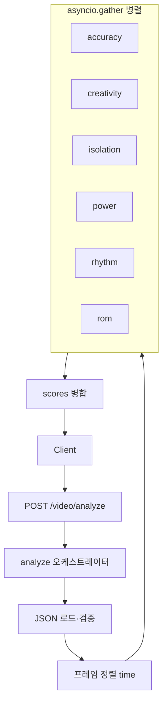
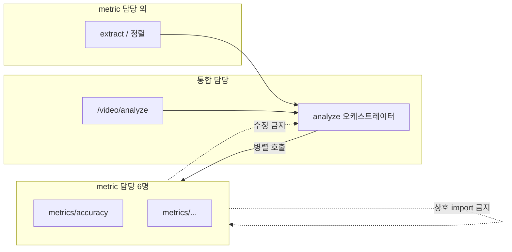

# Metrics 아키텍처

---

## 1. 구성

| 서비스 | 담당 범위 |
|--------|-----------|
| accuracy | `metrics/accuracy/` |
| creativity | `metrics/creativity/` |
| isolation | `metrics/isolation/` |
| power | `metrics/power/` |
| rhythm | `metrics/rhythm/` |
| rom | `metrics/rom/` |

- **6명 · 1인 1서비스** — 자기 `metrics/<이름>/` 만 수정한다.
- **다른 metric 폴더·라우터·오케스트레이터·추출 파이프라인** 은 수정하지 않는다.
- metric 서비스끼리 **import·호출하지 않는다.**

**통합(오케스트레이션) 영역** — metric 6명이 아닌 별도 담당:

- `POST /video/analyze` 라우터
- analyze 오케스트레이터 (JSON 로드, 정렬, 6서비스 병렬 호출, 결과 병합)

---

## 2. API 흐름

| 순서 | 엔드포인트 | 역할 |
|------|------------|------|
| 1 | `POST /video/extract` | 사용자·레퍼런스 영상 → 추출 JSON (각 1회) |
| 2 | **`POST http://localhost:8000/video/analyze`** | **6차원 채점 시작점** |

### 2.1 `POST /video/analyze`

**요청**

```json
{
  "user_json": "<사용자 추출 JSON 파일명>",
  "reference_json": "<레퍼런스 추출 JSON 파일명>",
  "alignment_method": "time"
}
```

**응답 (핵심)**

```json
{
  "alignment": { "method": "time", "pair_count": 120 },
  "scores": {
    "accuracy": { "score": 85.0, "breakdown": {} },
    "creativity": { "score": 80.0, "breakdown": {} },
    "isolation": { "score": 70.0, "breakdown": {} },
    "power": { "score": 68.0, "breakdown": {} },
    "rhythm": { "score": 65.0, "breakdown": {} },
    "rom": { "score": 72.0, "breakdown": {} },
    "total_score": 73.33,
    "grade": "B"
  }
}
```

- `total_score`·`grade`는 **오케스트레이터**가 6개 `score`를 합쳐 계산한다 (metric 서비스 책임 아님).

---

## 3. 런타임 구조



### 3.1 오케스트레이터 단계

| 단계 | 동기/비동기 | 설명 |
|------|-------------|------|
| JSON 로드·검증 | 동기, 1회 | 사용자·레퍼런스 추출 JSON |
| 프레임 정렬 | 동기, 1회 | `alignment_method: time` → `aligned_pairs` |
| 6채점 | **비동기 병렬** | 각 metric `score_*` 동시 실행 |
| 병합 | 동기 | `scores` + `total_score` + `grade` |

### 3.2 병렬 실행

- 라우터: `async` 핸들러.
- 각 metric `score_*`: **동기 함수**.
- `asyncio.gather` + `run_in_executor`로 6개를 **동시에** 실행한다.
- 입력(`aligned_pairs`, `user_extraction`)은 **읽기 전용** — scorer가 변경하지 않는다.
- 하나라도 실패하면 요청 전체 실패 (부분 응답 없음).

---

## 4. 오케스트레이터 → metric 입력

| 서비스 | 오케스트레이터가 넘기는 인자 |
|--------|------------------------------|
| accuracy | `aligned_pairs` |
| creativity | `aligned_pairs` |
| isolation | `aligned_pairs` |
| rom | `aligned_pairs` |
| power | `user_extraction` (사용자 JSON 전체) |
| rhythm | `user_extraction` |

`aligned_pairs` 원소 형태:

```json
{
  "user_frame": 0,
  "ref_frame": 0,
  "user": { "frame_index": 0, "joint_angles": {}, "bone_vectors": {}, "normalized_landmarks": {} },
  "ref": { "frame_index": 0, "joint_angles": {}, "bone_vectors": {}, "normalized_landmarks": {} }
}
```

---

## 5. metric → 오케스트레이터 반환

각 `score_*` 반환 형태 (통합 전):

```json
{
  "score": 85.0,
  "breakdown": {},
  "frame_diffs": []
}
```

| 필드 | 설명 |
|------|------|
| `score` | 0~100 |
| `breakdown` | 지표별 상세 (내용은 담당 서비스 자유) |
| `frame_diffs` | 선택 (accuracy 등 프레임 단위 피드백용) |

오케스트레이터가 `scores` 아래에 키 `accuracy`, `creativity`, `isolation`, `power`, `rhythm`, `rom` 으로 묶는다.

---

## 6. 경계 요약



| 구분 | metric 6명 | 통합 담당 |
|------|------------|-----------|
| `metrics/<이름>/` 내부 로직 | ✅ | ❌ |
| `/video/analyze` | ❌ | ✅ |
| 6서비스 병렬 호출·결과 병합 | ❌ | ✅ |
| 다른 metric / hub / 라우터 | ❌ | ✅ (오케스트레이션만) |

---

## 8. 통합 진입점 (`backend1`)

| 역할 | 경로 |
|------|------|
| HTTP 시작 | `backend1/main.py` → `uvicorn main:app` |
| 라우터 | `backend1/routers/video.py` |
| ROM 구현 | `metrics/rom/domain/domain1/` (`rom_path.py`로 import) |

| URL | 설명 |
|-----|------|
| `POST /video/analyze` | §2.1 JSON 채점 (오케스트레이터) |
| `POST /video/extract` | 영상 추출 — ROM `domain1` 위임 |
| `POST /video/compare` | JSON 2개 비교 (선택) |

`metrics/rom/main.py`, `metrics/rom/routers/` 는 **제거됨**. ROM 담당은 `domain/domain1` 만 수정.
